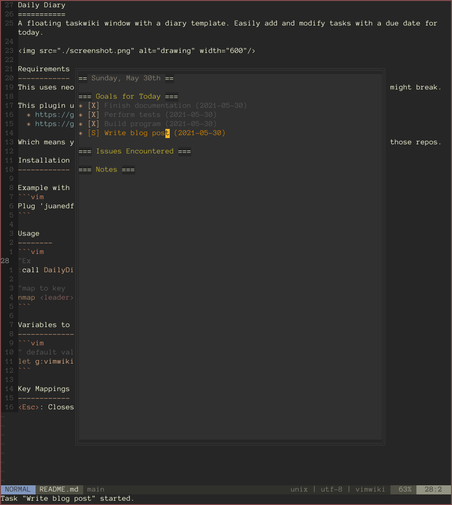

Daily Diary
===========
A floating taskwiki window with a diary template. Easily add and modify tasks with a due date for today.



Requirements
------------
This uses neovim's floating windows. Tested with neovim 0.5.0. Using earlier versions might break.

This plugin uses vimwiki and taskwiki.  
	* https://github.com/vimwiki/vimwiki  
	* https://github.com/tools-life/taskwiki  
	
Which means you will need to install taskwarrior and any other dependencies listed in those repos.

Installation
------------

Example with vim-plug:
```vim
Plug 'juanedflores/DailyDiary'
```

Commands
--------
```vim
:call ToggleDailyDiary()
```

Variables to Set
----------------
```vim
" default values
let g:vimwikidiaryPath = '~/vimwiki/diary'
```

Key Mappings
------------
`<Esc>`: Closes the floating window when in normal mode.
